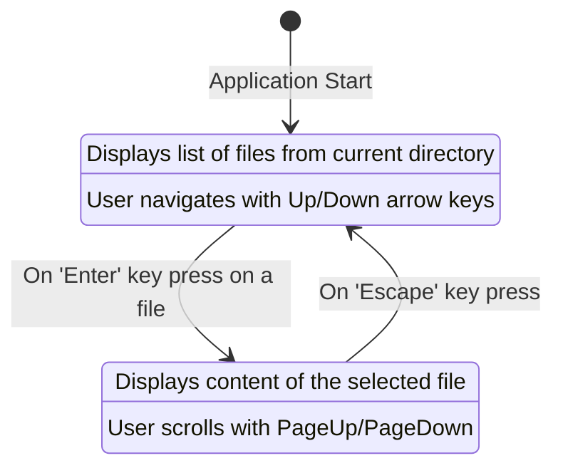

# Technical Specification: TUI File Viewer

This document outlines the technical details for a Terminal User Interface (TUI) application for browsing and viewing files in a directory.

## 1. Tech Stack

*   **Programming Language:** Go
*   **TUI Framework:** [Bubble Tea](https://github.com/charmbracelet/bubbletea) - A powerful, functional, and state-driven TUI framework for Go. It simplifies building complex terminal applications.
*   **Supporting Libraries:**
    *   [Bubbles](https://github.com/charmbracelet/bubbles): A library of ready-to-use components for Bubble Tea applications (e.g., list, viewport).
    *   [Lipgloss](https://github.com/charmbracelet/lipgloss): A library for style-based layout and rendering in the terminal.

This application is a standalone command-line utility and does not require a database, external APIs, or an authentication mechanism.

## 2. Core Data Models

The application's state will be managed through Go structs, central to the Bubble Tea architecture.

### `mainModel`

Represents the primary state of the application, managing the file list view.

```go
type mainModel struct {
    fileList      list.Model // A list component to display directory contents
    files         []fs.DirEntry // The list of files in the directory
    selectedFile  string      // The path of the file selected by the user
    width         int         // Terminal width
    height        int         // Terminal height
    err           error       // To hold any error messages
}
```

### `fileViewModel`

Represents the state when viewing the content of a single file.

```go
type fileViewModel struct {
    viewport    viewport.Model // A viewport component for scrollable content
    filePath    string         // Path to the file being viewed
    fileContent string         // The content of the file
    width       int            // Terminal width
    height      int            // Terminal height
}
```

## 3. System Architecture Diagram (State Flow)

The application follows a simple state transition model. The user starts in the `FileListView` and can transition to the `FileContentView`.



## 4. Critical API Endpoints

Not applicable. This is a self-contained, local TUI application and does not expose any network APIs. All operations are performed on the local filesystem.
